# Plataforma de ventas en línea

## Integrantes
+ Lorena Reyes 
+ Patricia Vidal

## Preámbulo

En el mundo hay muchas formas de vender en línea, el porcentaje de compradores
online sigue creciendo y la gama de cosas que pueden comprar también lo hace.
Como compradores no siempre somos conscientes de todo lo que debe pasar para que
los productos que necesitamos estén en una repisa del supermercado o de una
tienda. En el comercio minorista hay una serie de intermediarios que en
ocasiones nos hacen perder la pista del ‘viaje’ de un producto; un viaje que va
encareciendo el producto por cada empresa por la que debe pasar hasta que llega
a las manos de nosotros, los consumidores.
En esta realidad hay dos actores perjudicados: el consumidor, que acaba pagando
más por un producto y el productor o fabricante, que se ve presionado a vender
más barato para que su producto llegue al consumidor a un precio asequible y que
todos puedan beneficiarse en el camino.

## Introducción

### “Nuevo portal de e-commerce”

Nos han contactado de la Asociación Nacional de Pequeños Comerciantes, para ayudar a **Le Pastel Bakery** a hacer un estudio inicial de cómo debería ser este portal de ventas y cómo deben ofrecer los productos a los consumidores. Averiguar cómo son los consumidores que utilizaría este canal de venta y cuáles son sus motivaciones, cómo es el mercado actual en el que incursionarán; y que proponerles
una visión de cómo podría plantearse este nuevo canal de ventas.

## Le Pastel Bakery
Le Pastel Bakery es un negocio de pastelería artesanal en la ciudad de Lima, productos hechos a mano con mucho esmero brindan delicadas presentaciones para toda celebración, estos productos son hechos a pedido y se entregan de manera delivery o pick up.

Este es el logo original de la empresa que usa en sus redes sociales (Facebook e Instagram) 

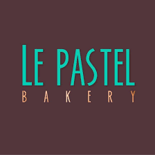 

 Link del fan page en Facebook: [Click aquí para ver el fan page](https://www.facebook.com/lepastelbakery/) 

 Link de Instagram: [Click aquí para ver en instagram](https://www.instagram.com/lepastelbakery/) 

## Objetivo del proyecto
El objetivo es fidelizar una mayor cantidad de clientes para generar más ventas por medio de un e-commerce.

## Distribución de actividades

|Actividad|Descripción|Puntos|
|:----|:---|:---:|
|Entrevistas con cliente|Realización de entrevistas con el cliente (dueño del reto) y establecimiento de sus metas y objetivos.|25|
|Benchmark| Revisión de features de la competencia y referencias análogas. | 20 |
|Entrevistas con usuarios| Entrevistas en profundidad con al menos 5 usuarios. | 60 |
|Flujo / árbol de contenidos|Documento que estructura contenidos y su navegación|15|
|Testeos de prototipos| Sesiones de testing de la solución propuesta con al menos 5 usuarios. | 60 |
|Sketching y wireframing| Elaboración de prototipos de baja y mediana fidelidad. | 30 |
|Prototipado de alta fidelidad| Elaboración de prototipo en base a las pantallas diseñadas. | 80 |
|| Total |  290 |

## Planificación
Para poder empezar a hacer todos los puntos elegidos y desarrollar el proceso de UX, tomamos en cuenta hacer una planificación en Trello y así puedan ver los pasos a seguir con límite de tiempo para cumplir con el deadline.

Aquí link de planificación en Trello [Click aquí](https://trello.com/b/B908O8bz/le-pastel-bakery) 

 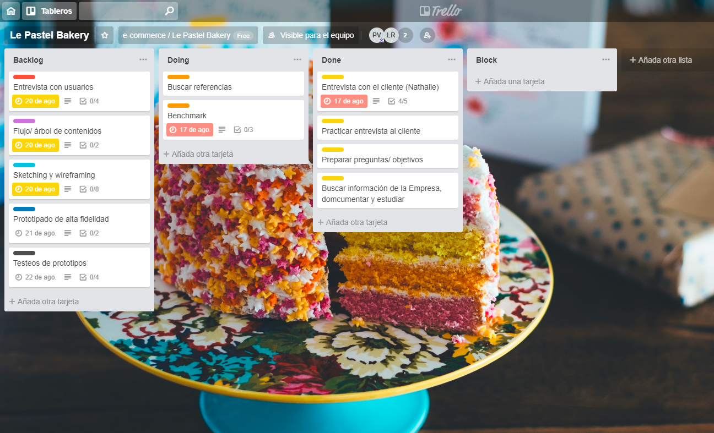 

## Benchmark
Revisando la competencia o industrias similares:

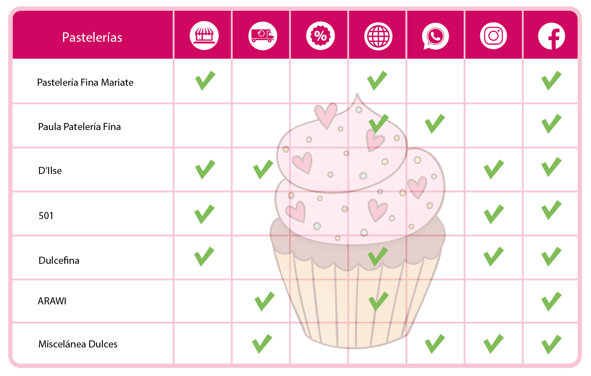 

## Entrevista con el cliente

**Objetivos** 
Entender la percepción que el cliente tiene sobre el valor que se generaría para su empresa  al  implementar su e-commerce.
Entender la diferenciación de su empresa con otras 
Como este trabajaría conjuntamente con su modelo de negocio existente.
Conocer todo lo que el cliente conoce entorno a su negocio (servicios, canales de venta, sistema de envío, valor agregado ).
Establecer objetivos esperados de diseño, obtener referencias de webs que le gusten.

Este es el link del video de la entrevista con el cliente: 
:sound: [Entrevista con el cliente (video)](https://www.youtube.com/watch?v=Kze9_W_4tdo&feature=youtu.be) 

**Introducción** 
Hola, Soy [Lorena o Patricia], estudiantes en laboratoria. Esta entrevista es para conocerte un poco, conocer sobre tu empresa. 
Antes que nada, ¿estás de acuerdo con que grabemos esta entrevista? Puede ser un video o una grabación de voz. No será usada en otra cosa que no sea esta investigación, la grabación no será publicada, es solo con fines de estudio.

**Guía de preguntas**  
Cuéntame sobre tu negocio 
1. ¿Qué te motivó a crear tu empresa?
2. ¿Cuál es tu diferenciación con otras empresas del mismo rubro?
3. ¿Cuál es tu visión a corto plazo ?
4. ¿Cómo utilizas las redes sociales para ventas?
5. ¿Qué servicios ofreces en las redes sociales?
6. ¿Podrías decirnos quiénes son tus compradores habituales? (edad, sexo)
7. ¿Qué te motivó a trabajar con redes sociales?
8. ¿Cuál es el producto que tiene mayor rotación?
9. ¿Cómo haces la venta en línea?
10. ¿Cuéntame sobre tu última venta en línea, cómo te fue?, te funcionó bien?
11. ¿Quién es su competencia?
12. ¿Cómo te gustaría proyectar tu imagen en una página web?
13. Tú administras tu fan page de facebook o tienes un community manager?
Muchas gracias por compartir con nosotras sobre tu empresa.

**Conclusión de la entrevista con el cliente** 
Nos reunimos en un Starbucks para realizar la entrevista con nuestro cliente, el cliente fue muy amigable, colaboró respondiendo las preguntas que fueron variando según la fluidez de las respuestas que recibíamos de su parte, de modo que fue de forma más natural posible a una conversación más que a un cuestionario. **Le Pastel Bakery** es una pastelería que realiza pedidos a delivery y pick up, aún no cuenta con local, nos comentó que le gustaría mucho agregarle a su servicio que sea tipo cafetería y poder recibir a sus clientes ya que antes ella ha trabajo en contacto con el público y que su experiencia sumaría a tener un negocio más completo. 

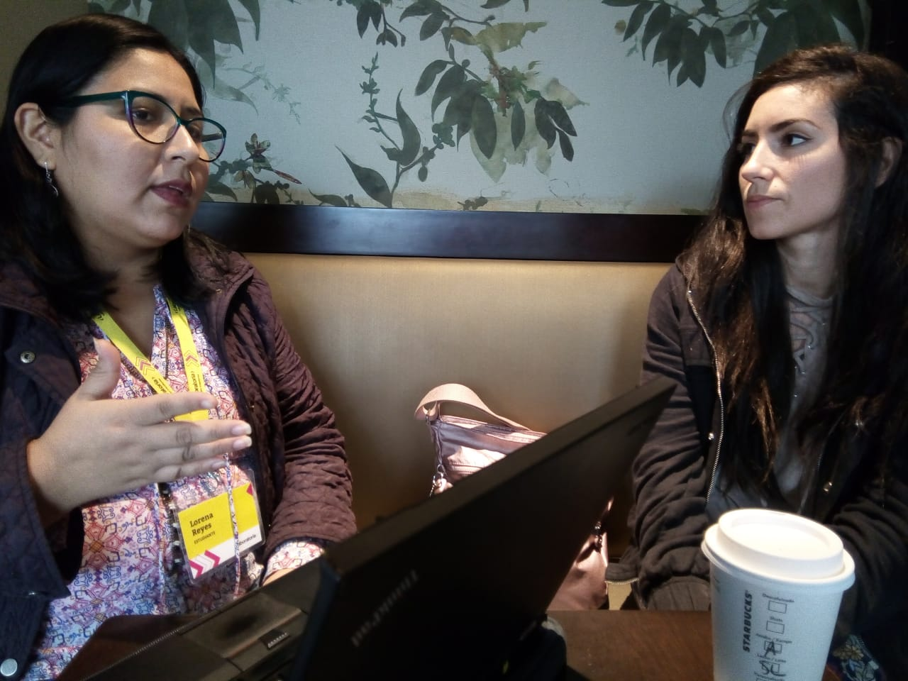  

Pudimos identificar que **Le Pastel Bakery** es su pasión, y que hace con esmero su trabajo, tomando en cuenta todo el proceso para tener un buen resultado nos resaltó que la elección en la calidad de sus ingredientes es algo elemental para crear un buen producto.

Actualmente es su hermana la que ve la línea gráfica de la empresa, quien maneja las redes sociales (facebook e instagram), toma los pedidos en whatsapp y a continuación los planifica para ser entregados en 24 horas. 

## Entrevista con el usuario 
**Objetivos** 
Conocer lo que los usuarios valoran al realizar una compra online.
Entender las necesidades de los usuarios.

Este es el link de los audios de las entrevistas con usuarios: 
:sound: [Entrevistas a usuarios (audios)](https://soundcloud.com/patricia-vidal-136075208/sets/pasteleria-entrevistas-a) 

**Introducción** 
Hola, Soy [Lorena o Patricia], hoy voy a conversar contigo para que me cuentes un poco sobre tus hábitos de compra.

**Guía de preguntas** 
+ ¿ Cual es tu nombre?, cuéntame un poco sobre ti, ¿Cómo va  tu día?
+ ¿Has comprado  por internet?
+ ¿Por qué compras por internet?
+ ¿Qué tipo de producto compras con más frecuencia?
+ ¿Cuándo fue la última vez que compraste por internet? ¿Cómo fue tu experiencia?
+ ¿Has  pedido alguna vez un postre o torta x internet? ¿En dónde?
+ ¿Cómo encontraste o contactaste con la empresa (tienda)?
+ ¿Por qué la escogiste?
+ ¿Con qué frecuencia haces un pedido?
+ ¿Cuéntame sobre tu última experiencia como fue el proceso de compra?
+ ¿Cómo realizaste el pago?
+ ¿Cómo recibiste el pedido?
+ Algún detalle o comentario adicional
+ Gracias por tu tiempo.

**Conclusión de entrevista con usuarios** 
Definitivamente fue una experiencia enriquecedora obtener información de los usuarios ya que estos son los primeros que interactúan con el producto, quienes evalúan el servicio según su experiencia hacen que el producto se mantenga en pie por el valor que les brinda al satisfacer su necesidad lo que a la vez favorece positivamente a la empresa ya que se logra que se promocione boca a boca y que aumenten los pedidos lo que generaría mayores ingresos y la oportunidad de poder crecer como empresa y generar ese vínculo entre los usuarios y el producto.

## Afinity map
Aquí ordenamos la información relevante de las entrevistas de usuarios, seleccionando los temas de las preguntas para poder ubicar las frustraciones, necesidades respecto a comprar un producto por internet.

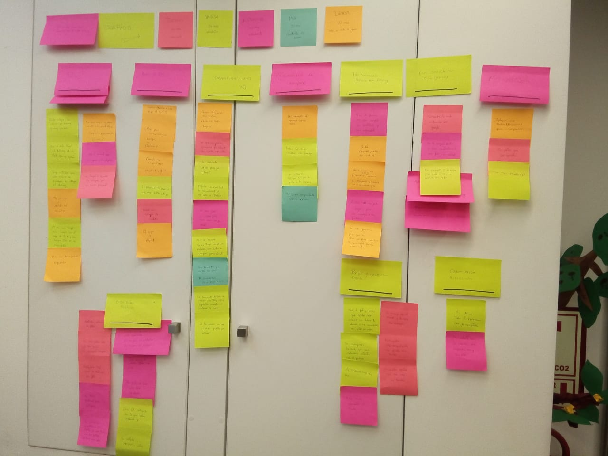 

## User person

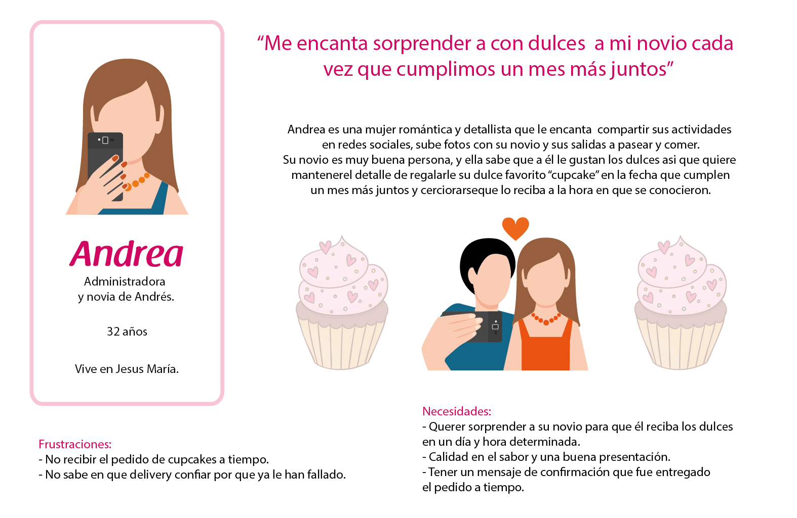 

## Journey customer

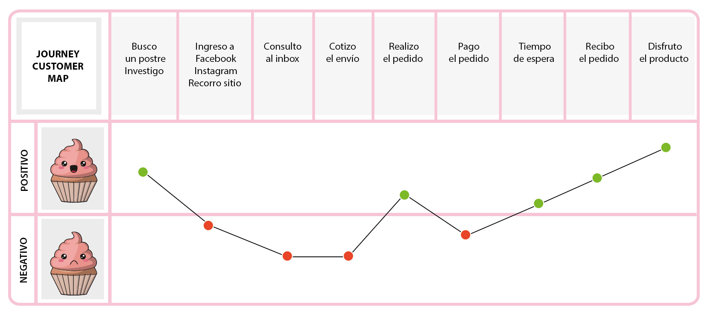 

## Definición del producto

*  **Quiénes son los principales usuarios de producto** 
Los principales usuarios de **Le Pastel Bakery** son mujeres millennials (entre los 18 y 35 años), aficionadas a los dulces, que llevan una vida activa siendo estudiantes o trabajadoras, además suelen hacer ejercicios como caminatas largas, correr, ir al gimnasio, bailar zumba. Utilizan las redes sociales como Facebook, Instagram, Snapchat, Twitter para comunicarse con frecuencia y subir fotos de las actividades que realizan.

*  **Cuáles son los objetivos del negocio en relación con el producto** 
Los objetivos del negocio **Le Pastel Bakery** son que las personas que consumen sus productos queden satisfechas con la calidad del producto elegido no solo por el sabor sino también por la presentación. También que los usuarios puedan hacer los pedidos que necesiten y recibirlos en el lugar que se encuentren sin necesidad de que vayan a la tienda físicamente. Además, los usuarios tienen la característica de subir a redes sociales lo que les gusta y así puedan compartir una foto del producto con sus amistades, lo que a su vez aumenta la posibilidad de incrementar ventas con la gente que sigue a estos usuarios al ver las recomendaciones positivas del producto y servicio. 

*  **Cuáles son los objetivos de estos usuarios en relación con el producto** 
Los objetivos de los usuarios son que el precio sea accesible, recibir al tiempo acordado su pedido, que tenga un buen sabor y mantenga esa calidad en cada pedido. 

*  **Cuál será la propuesta de valor del sitio que vas a crear** 
La propuesta de valor que proponemos es fidelizar a los usuarios frecuentes invitándoles a que personalicen los pedidos que realizan. Los usuarios registrados pueden elegir una frase predeterminada y compartir el producto como un regalo más completo a quien desean enviar para sorprender con ese detalle. Otra propuesta de valor que ofrece **Le Pastel Bakery** es el de contestar pronto los mensajes manteniendo asi una comunicación fluida creando una relación de confianza.

*  **Cuáles son los contenidos que el usuario quiere ver, la información que buscarían para convencerse de comprar, confiar en la empresa que lo ofrece, encontrar lo que busca y comprarlo** 
La interacción con la empresa es basicamente visual (por web o mobile) es por ello que lo ideal es tener fotos de calidad de los productos que generen confianza por la buena presentación y los comentarios de otros usuarios frecuentes. Lo que el usuario quiere es poder ver la lista de productos para decidirse por uno de ellos para a continuación elegir el sabor y cantidad. Además que el flujo para realizar el pedido sea de fácil acceso y que sea práctico a la hora de concretar el pago.

*  **Cómo vas a distribuir y entregar esos contenidos** 
Colocando primero un menú para distinguir las secciones principales, luego un slide con banner de varias ofertas de los productos que puede escoger el usuario. 

*  **Cómo es el flujo que los usuarios que acaben comprando deberán hacer en la web** 
En la sección menú tienda puede encontrar una lista de todos los productos distribuidos con sus respectivos slides que presenten imagenes con nombres de las versiones que hay de dicho producto y los sabores que tienen además de los precios que varían dependiendo de si los frutos son de la temporada. Una vez elegido el producto seleccionando con los botones para realizar el pedido a la dirección que quiere recibir la entrega, eligiendo el método de pago (tarjeta visa, mastercard) concluir con la espera de la entrega del producto.

*  **Cómo crees que el producto les está resolviendo sus problemas** 
El problema que resuelve es que la entrega del producto es el mismo que la foto que presentan en redes sociales, lo que también crea un ambiente de confianza al momento de realizar la acción de compra.

## Árbol de contenidos
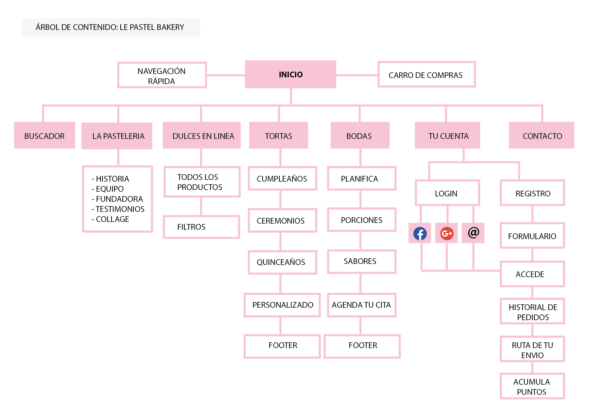 

## How might we? (¿Cómo podríamos?)
 Tomamos en cuenta la información que recibimos para analizarla y poder obtener un flujo adecuado de los usuario. 

 + **¿Cómo generar confianza para que se concluya la compra?** 
Tener testimonios de usuarios frecuentes, que escriban sobre la calidad del producto tanto como del servicio, un espacio para comentarios de los usuarios. 

+ **¿Cómo hacer que la compra sea más rápida?** 
Ser una plataforma amigable, sencilla sin muchos pasos y que brinde la información necesaria.

+ **¿Cómo hacer que la comunicación sea familiar y personalizada?** 
Utilizando un vocabulario no formal, fácil de entender.

+ **¿Cómo hacer que los clientes compren de manera más frecuente?** 
Manteniendo la calidad de los insumos, la presentación y la entrega del mismo. 
Fidelidad, creando puntos de compra. Ofreciendo descuentos de temporada que inviten a consumir los productos con las frutas de la estación. Promoviendo una cartilla de descuento.

+ **¿Cómo incluir el contacto directo entre el cliente y el comprador dentro del proceso de compra?** 
Para tener una respuesta pronta y la comunicación sea fluida, proponemos  linkear whatsapp en la versión de celular y web.

+ **¿Cómo permanecer más tiempo en la mente de los consumidores?** 
Linkeando las actualizaciones de las imágenes a las redes sociales.

+ **¿Cómo hacer seguimiento a las compras?** 
Por parte del cliente (crear un dashboard con notificaciones, alertas) y del servicio (ver ruta de envío)

+ **¿Cómo transmitir la esencia de la empresa a través de la web?** 
La calidad de las fotos, la guía de colores, el vocabulario (la voz)

+ **¿Cómo dar a conocer las ofertas de manera efectiva?** 
Visualizando desde un inicio en la web banner con las ofertas.

+ **¿Cómo conseguir feedback del usuario?** 
Ranking (iconos en forma de estrellas) una vez terminada la entrega del pedido, permitir comentarios de otras personas abajo del producto elegido.

+ **¿Cómo comunicar la calidad de los insumos al usuario?** 
Con un video corto del proceso de preparación.

## Sketch, Wireframe y Prototipo

Link de las vistas de sketch para mobile y web:  
[Click aquí para ver sketch mobile y web](https://drive.google.com/drive/folders/1GznXMyCEZWHnHXo0S8daCKo-GFA6CJMh?usp=sharing)

+ Prototipo de baja fidelidad (Sketch) 
+ Prototipo de media fidelidad (Wireframe)
+ Prototipo de alta fidelidad

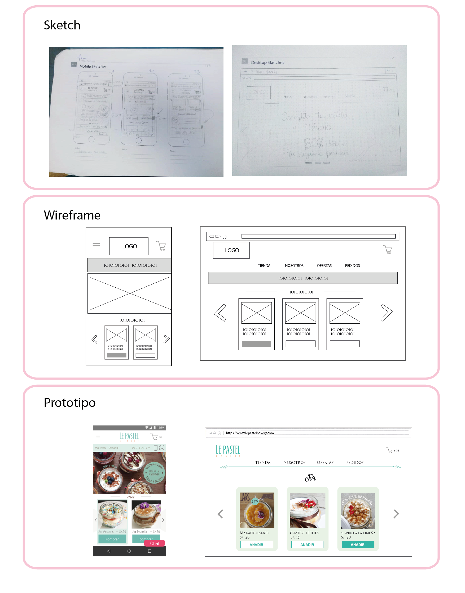 

* **Testeo de Sketch**
[Testeo 1](https://www.youtube.com/watch?v=b59j1YJEjHs&feature=youtu.be) 
[Testeo 2](https://www.youtube.com/watch?v=Kd3P_mPDPAs&feature=youtu.be) 
[Testeo 3](https://www.youtube.com/watch?v=bSiqrPpeax4&feature=youtu.be) 

## Prototipo interactivo

Link de las vistas con interacción de prototipo de alta fidelidad:  
[Click aquí para version mobile](https://xd.adobe.com/view/031a5549-e0c7-4bdc-42fe-5845885afa81-752b/screen/ff38d2e8-9c41-4984-9343-abe14c6f5f60/iPhone-6-7-8-11?fullscreen) 
[Click aquí para version web](https://xd.adobe.com/view/031a5549-e0c7-4bdc-42fe-5845885afa81-752b/?fullscreen) 

* **Testeo de prototipo en alta**
Este es el link de testeo a usuarios con el prototipo web en alta:  
[Click aquí para ver el video del testeo](https://soundcloud.com/patricia-vidal-136075208/sets/test-de-prototipo)

## Mock up mobile y web
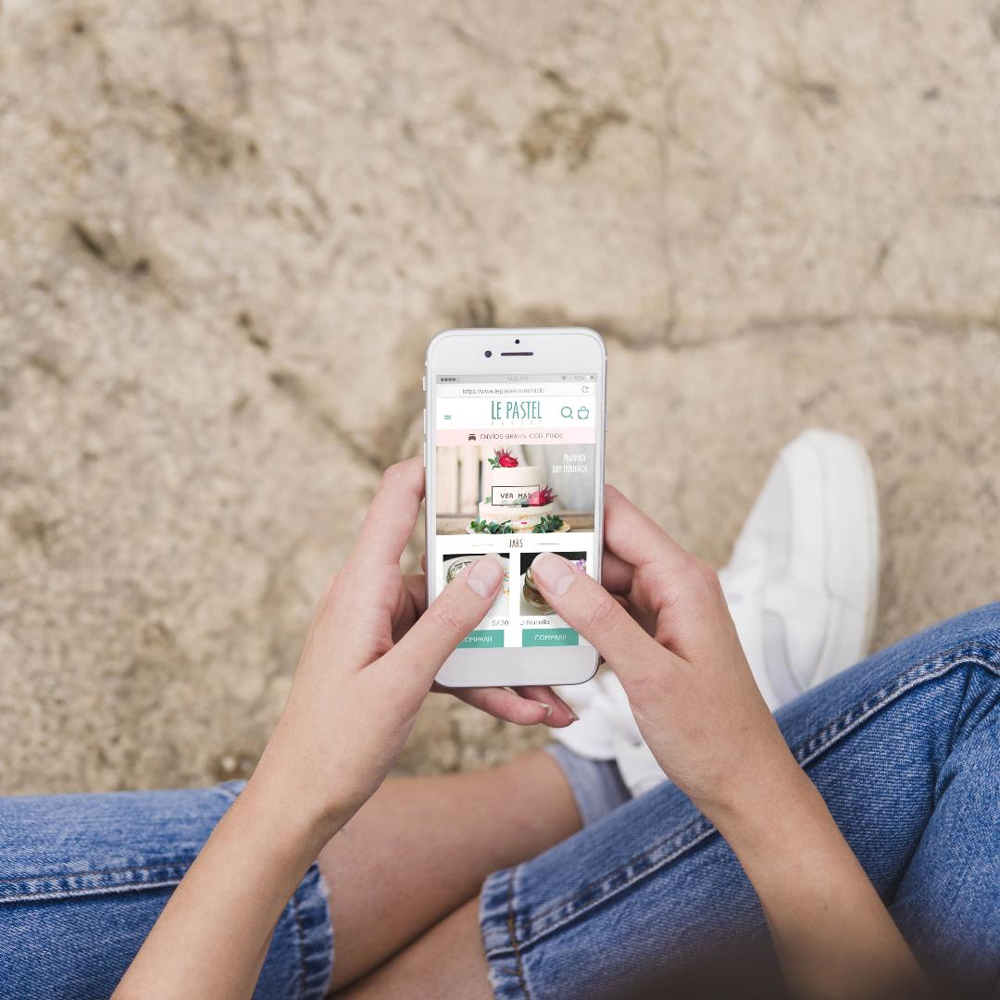 
 

## **Carpeta de proyecto**
Aquí encontrarás carpetas con los archivos expuestos con más detalle. 
[Click aquí para abrir la version de Google Drive](https://drive.google.com/drive/folders/1Hy-bi_Bobgn6jckr-qyZ69qC8dpWXpbV?usp=sharing)

Video en loom:  
[Click aquí para ver el video en loom](https://www.useloom.com/share/0571c70916f847299696dbe022ed76e3)

Link para compartir el diseño con los desarrolladores: 
[Click aquí para desarrolladores](https://xd.adobe.com/spec/0c72d788-ae6c-4f47-7490-6f9ab6ce536b-7a43/)

## **Gracias**

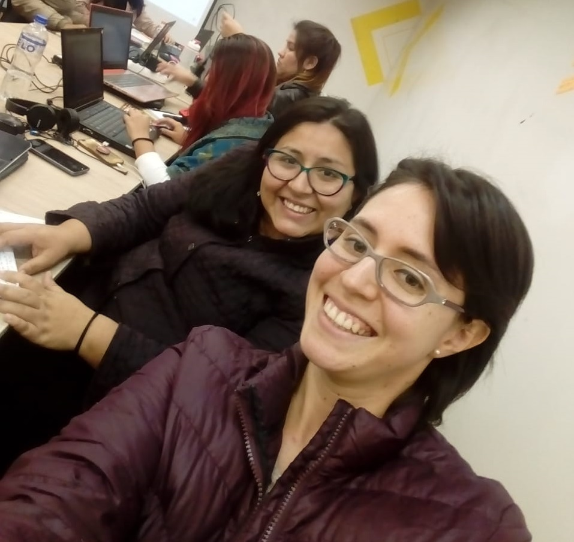 

