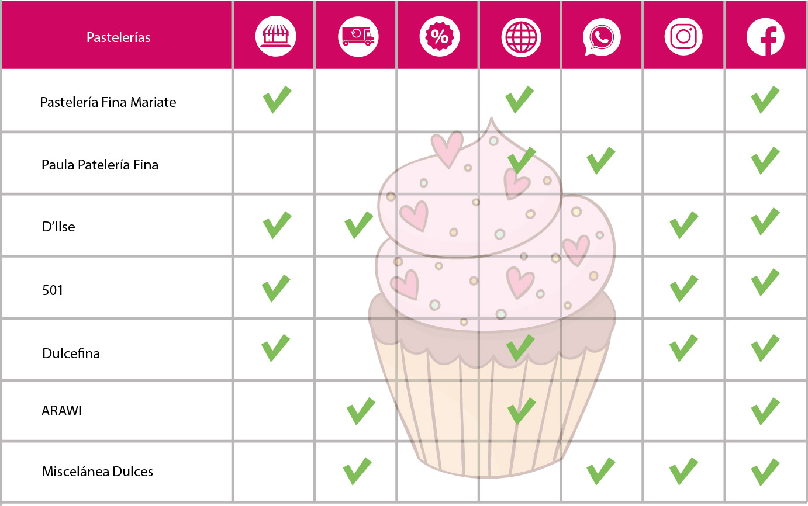

# Plataforma de ventas en línea

## Preámbulo

En el mundo hay muchas formas de vender en línea, el porcentaje de compradores
online sigue creciendo y la gama de cosas que pueden comprar también lo hace.
Como compradores no siempre somos conscientes de todo lo que debe pasar para que
los productos que necesitamos estén en una repisa del supermercado o de una
tienda. En el comercio minorista hay una serie de intermediarios que en
ocasiones nos hacen perder la pista del ‘viaje’ de un producto; un viaje que va
encareciendo el producto por cada empresa por la que debe pasar hasta que llega
a las manos de nosotros, los consumidores.
En esta realidad hay dos actores perjudicados: el consumidor, que acaba pagando
más por un producto y el productor o fabricante, que se ve presionado a vender
más barato para que su producto llegue al consumidor a un precio asequible y que
todos puedan beneficiarse en el camino.

## Introducción

### “Nuevo portal de e-commerce”

Nos han contactado de la Asociación Nacional de Pequeños Comerciantes, una
asociación que agrupa a pequeñas y medianas empresas productoras y fabricantes
de alimentos naturales, postres, accesorios, vestimenta y calzado, y nos piden
que asesoremos a **uno** de sus miembros en crear un portal desde donde los
consumidores compren sus productos sin intermediarios: 

- [Le Pastel Bakery](https://www.instagram.com/lepastelbakery/)

Luego de elegir con qué miembro trabajarás, la ANPC te pide que ayudes a ese
miembro a hacer un estudio inicial de cómo debería ser este portal de ventas y
cómo deben ofrecer los productos a los consumidores. Quieren que averigües cómo
son los consumidores que utilizaría este canal de venta y cuáles son sus
motivaciones, cómo es el mercado actual en el que incursionarán; y que propongas
una visión de cómo podría plantearse este nuevo canal de ventas.

Una vez conozcas a los posibles compradores debes formular una propuesta de
valor. Esto quiere decir que debes pensar cómo este portal va a comunicar sus
beneficios a los usuarios y cómo va a vender sus productos. Para que guíes a la
empresa que elijas a entender tu visión, esperan que les hagas una propuesta de
cómo podría ser el portal donde las personas puedan buscar, ver, elegir y
comprar sus productos.

## Objetivos de aprendizaje

El objetivo principal de aprendizaje de este proyecto es entender cómo pasamos
de lo que un cliente quiere alcanzar a la definición de un producto digital en
poco tiempo. Entender los principales pasos y preguntas que debemos hacernos,
cómo involucrar a los usuarios y su feedback y cómo usar esos resultados sin
perder de vista los objetivos iniciales.
Esperamos que en este proyecto puedas entender las necesidades y falencias de
las empresas, aprender y empezar a empaparte de los posibles modelos de negocio
así como investigar a su audiencia, los usuarios que consumen sus productos,
entendiendo sus preferencias y contexto en el que lo hacen.

De la misma manera deberás definir cuál es la mejor forma de ofrecerle los
productos de tu cliente a sus usuarios, y, pensando en una propuesta de valor y
sus objetivos. También, deberás definir los contenidos, la interacción y el
diseño del proceso a partir del cual el usuario podrá hacer sus pedidos en esta
plataforma.
Este proyecto se debe "resolver" en parejas, por lo que un objetivo importante
es ganar experiencia en trabajos con entrega grupal. Cada uno de las integrantes
será responsable de una parte del trabajo: (1) el entendimiento del problema y
(2) planeamiento y validación de la solución.

## Tópicos a cubrir

Para completar este proyecto tendrás que familiarizarte con conceptos como: UX
research (entrevistas, benchmark), arquitectura de la información (flujo de
contenido, mapa de sitio), diseño visual y de interacción (wireframes y
prototipado), y user testing.

## Consideraciones generales

Para ser una gran UX no sólo debes familiarizarte con los conceptos sino,
también, poner a prueba tus habilidades blandas. El uso de tu curiosidad y
empatía son claves para el éxito laboral.
Para poder realizar una buena entrevista, un benchmark o un user testing
necesitas en todo momento estar atenta al cómo y no sólo al qué. En este
sentido, es esencial que practiques el modo en que te comunicas frente al
cliente y el usuario. Debes pensar quiénes son y qué es lo que necesitan, y no
sólo enfocarte en lo que tú quieres comunicar.

* Relación con el cliente: la empresa miembro con la que te toque trabajar será
tu cliente. Saber relacionarte con ellos no es fácil. Para comenzar una buena
relación con el cliente debes escuchar de manera activa qué es lo que necesitan,
haciendo preguntas que te ayuden a entender sus necesidades para luego buscar
cómo resolverlas. No trates de dar soluciones inmediatas, escucha y pregunta, la
curiosidad es clave para entender la problemática. El problema del cliente no
siempre es el primero que parece, debes investigar la empresa y la competencia
para entender lo que sucede. Para mantener una buena relación con los clientes
debes mostrarle cómo se beneficiarán de lo que ofreces; enséñale los posibles
resultados y el beneficio que ellos podrían obtener. También debes estudiar las
mejores prácticas en la industria del comercio electrónico para poder mostrarle
al cliente casos de éxito.

* Benchmark: revisar referencias y dar referencias es clave para tu relación con
el cliente. Antes de comenzar a crear cualquier producto debes revisar qué está
haciendo la competencia o industrias similares. De esta manera, puedes traer
buenas prácticas y evitar replicar aquellas que no son exitosas. Esto al cliente
le da la confianza de que efectivamente tienes conocimiento de su problemática y
que has estudiado todas las posibles soluciones. Para que el benchmark sea
efectivo, tu curiosidad y pensamiento crítico deben ser altos; no sólo buscar
las referencias que resulten obvias, sino otras industrias que puedan funcionar
de manera similar o empresas pequeñas que están teniendo casos de éxito.

* Presentación del plan, a dónde vas a ir y por qué: al resolver la problemática
debes realizar un plan de trabajo, donde se visualicen las herramientas que
estás utilizando y por qué las escogiste. No todas las problemáticas requieren
que utilices las mismas herramientas. Debes utilizar la que mejor se ajuste. Es
importante que siempre sustentes tu idea, no se trata de trabajar de manera
mecánica para entregar algo al cliente, sino argumentar por qué esa es la mejor
manera de aproximarse a una posible solución.

* Testing centrado en el usuario: Realizar las pruebas con los usuarios
garantiza que los problemas se detecten antes, las buenas ideas se introducen
más rápido y se reducen los esfuerzos de diseño y desarrollo de productos
innecesarios. Steve Jobs, una vez dijo: "El diseño no es sólo cómo se ve y cómo
se siente. El diseño es cómo funciona”. Las pruebas de usabilidad son una
técnica que ayuda a evaluar un producto al probarlo con usuarios reales. El
testing es una buena forma de profundizar en las necesidades y preferencias de
los usuarios observando sus reacciones mientras usan un producto. Para que el
testing realmente esté centrado en el usuario, tú debes centrarte también en él,
actuando con curiosidad y empatía en todo momento, preguntando de manera activa
al usuario qué podrías mejorar y buscar aquellos errores que llevarán tu
producto al siguiente nivel. No trates de que el usuario apruebe tu producto,
llévalo a buscar las mejoras y posibles errores, generando una relación de
confianza con el usuario.

Tu curiosidad, empatía y pensamiento crítico son claves para tu éxito como UX
Designer. En cada herramienta que utilices debes poner a prueba tus soft skills.
Nunca des nada por supuesto, siempre pregunta hasta encontrar nuevas respuestas,
debes actuar en todo momento con un pensamiento crítico, sino harás de manera
mecánica tus proyectos sin encontrar soluciones innovadoras. Sé una
investigadora, tu curiosidad es clave en los procesos creativos; pregunta
constantemente y no intentes buscar soluciones inmediatas, aprende a navegar con
la incertidumbre. La empatía es la habilidad que te va a guiar en las relaciones
tanto con el cliente como con el usuario, intenta salir de tu mente y tus
supuestos para entender cómo piensan los otros.

## Parte Obligatoria

### 1) General

En este proyecto necesitarás salir a hablar con usuarios reales y entender
cuáles son sus necesidades, cómo las resuelven actualmente y proponer una
solución óptima para resolver estas necesidades. Mientras resuelves el proyecto
vas a tener que ir documentando las actividades que realices a través de fotos,
videos, textos y scripts. Utiliza tu en Google Drive para guardar toda esta
documentación y luego linkea las partes más importantes en el `README.md` de tu
repositorio en GitHub.

En este caso el README.md será la portada de tu solución final, en él tendrás
que mostrar la solución final a través de screenshots y podrás compartir links a
las secciones que detallaremos más adelante.

### 2) Entendimiento del problema

Durante esta parte te asegurarás que el producto que diseñarás es el correcto,
es decir, que sigue objetivos de negocio y que resuelve necesidades reales de
los usuarios. Para ello tendrás que entender al cliente (el miembro de la
Asociación Nacional de Pequeños Comerciantes con quien estás trabajando) y a los
usuarios. Luego de entender el problema, tendrás que plantear cómo es que vas a
resolver dicho problema. Para ello puedes realizar muchas actividades, sin
embargo el tiempo y los recursos que tienes son limitados. Tendrás que elegir
bien qué actividades realizarás.

### 3) Planteamiento y validación de la solución

Luego de haber definido cómo es que será la solución, es decir qué
funcionalidades tendrá y por qué, tendrás que implementarla. En este caso,
tendrás que hacer un prototipo de alta fidelidad y tendrás que validarlo. Cómo
en el caso anterior, para crear y validar la solución puedes realizar muchas
actividades, depende de ti elegir cuáles son las más adecuadas para el caso y
los recursos que tienes.

## Distribución de actividades

|Actividad|Descripción|Puntos|
|:----|:---|:---:|
|Entrevistas con cliente|Realización de entrevistas con el cliente (dueño del reto) y establecimiento de sus metas y objetivos.|25|
|Benchmark| Revisión de features de la competencia y referencias análogas. | 20 |
|Entrevistas con usuarios| Entrevistas en profundidad con al menos 5 usuarios. | 60 |
|Flujo / árbol de contenidos|Documento que estructura contenidos y su navegación|15|
|Testeos de prototipos| Sesiones de testing de la solución propuesta con al menos 5 usuarios. | 60 |
|Sketching y wireframing| Elaboración de prototipos de baja y mediana fidelidad. | 30 |
|Prototipado de alta fidelidad| Elaboración de prototipo en base a las pantallas diseñadas. | 80 |
|| Total |  290 |

## Le Pastel Bakery
Es una pasteleria Artesanal de excelente calidad. Cuenta con servicio de Delivery y Pick-up.
Este es el logo original de la empresa, que usa en sus redes sociales (Facebook e Instagram) 
 Link del fan page en Facebook: [Click aquí para ver el fan page](https://www.facebook.com/lepastelbakery/) 
 Link de Instagram: [Click aquí para ver en instagram](https://www.instagram.com/lepastelbakery/)

  

## Planificación
Para poder empezar a hacer todos los puntos elegidos y desarrollar el proceso de UX, tomamos en cuenta hacer una planificación en Trello y así puedan ver los pasos a seguir con límite de tiempo para cumplir con el deadline.

Aquí link de planificación en Trello [Click aquí](https://trello.com/b/B908O8bz/le-pastel-bakery) 

  

## Benchmark
Revisando la competencia o industrias similares:

 

## Guía de preguntas para la entrevista con el cliente

Cuéntame sobre tu negocio 
1. ¿Qué te motivó a crear tu empresa?
2. ¿Cuál es tu diferenciación con otras empresas del mismo rubro?
3. ¿Cuál es tu visión a corto plazo ?
4. ¿Cómo utilizas las redes sociales para ventas?
5. ¿Qué servicios ofreces en las redes sociales?
6. ¿Podrías decirnos quiénes son tus compradores habituales? (edad, sexo)
7. ¿Qué te motivó a trabajar con redes sociales?
8. ¿Cuál es el producto que tiene mayor rotación?
9. ¿Cómo haces la venta en línea?
10. ¿Cuéntame sobre tu última venta en línea, cómo te fue?, te funcionó bien?
11. ¿Quién es su competencia?
12. ¿Cómo te gustaría proyectar tu imagen en una página web?
13. Tú administras tu fan page de facebook o tienes un community manager?

## Conclusión de la entrevista con el cliente
Fue sencillo citar a la dueña del negocio **Le Pastel Bakery** ya que el negocio está en crecimiento y la misma dueña estaba disponible. Nos reunimos en un Starbucks para realizar la entrevista, fue muy amigable, colaboró respndiendo las preguntas, que fueron variando respecto a las respuestas de la clienta para que sea de forma más natural posible a una conversación más que a un cuestionario. **Le Pastel Bakery** es una pastelería que realiza pedidos a delivery y pick up, aún no cuenta con local, nos comentó que le gustaría mucho agregarle a su servicio que sea tipo cafetería y poder recibir a sus clientes ya que antes ella ha trabajo en contacto con el público. 

  

Pudimos identificar que **Le Pastel Bakery** es su pasión, y que hace con esmero su trabajo, tomando en cuenta todo el proceso para tener un buen resultado nos resaltó que la calidad de sus ingredientes es algo elemental, desde la elección de la harina, los frutos.

Actualmente es su hermana la que ve la línea gráfica de la empresa, quien maneja las redes sociales (facebook e instagram), toma los pedidos en whatsapp y a continuación los planifica para ser entregados en 24 horas. 

## Guía de preguntas para la entrevista con el usuario 
* **Objetivos** 
Conocer lo que los usuarios valoran al realizar una compra online.
Entender las necesidades de los usuarios.

Este es el link para que escuches los audios de las entrevistas con usuarios: 
[Entrevistas(audios)](https://soundcloud.com/patricia-vidal-136075208/sets/pasteleria-entrevistas-a) 

**Introducción** 
Hola, Soy [Lorena o Patricia], hoy voy a conversar contigo para que me cuentes un poco sobre tus
hábitos de compra.

**Guía de preguntas**  
+ ¿ Cual es tu nombre?, cuéntame un poco sobre ti, ¿Cómo va  tu día?
+ ¿Has comprado  por internet?
+ ¿Por qué compras por internet?
+ ¿Qué tipo de producto compras con más frecuencia?
+ ¿Cuándo fue la última vez que compraste por internet? ¿Cómo fue tu experiencia?
+ ¿Has  pedido alguna vez un postre o torta x internet? ¿En dónde?
+ ¿Cómo encontraste o contactaste con la empresa (tienda)?
+ ¿Por qué la escogiste?
+ ¿Con qué frecuencia haces un pedido?
+ ¿Cuéntame sobre tu última experiencia como fue el proceso de compra?
+ ¿Cómo realizaste el pago?
+ ¿Cómo recibiste el pedido?
+ Algún detalle o comentario adicional
+ Gracias por tu tiempo.

## Afinity map
Aquí ordenamos la información relevante de las entrevistas de usuarios, seleccionando los temas de las preguntas para poder ubicar las frustraciones, necesidades respecto a comprar un producto por internet.

 

## User person
Estas son las caraterísticas de nuestro user person:

 

## Journey customer map

 

## Sketch (version mobil y web)

Link de las vistas de sketch para mobil y web: [Click aquí](https://drive.google.com/drive/folders/1zymIPiwLwGnDxMbJs32mi2z07w6BqDVG?usp=sharing)

## Prototipo de alta fidelidad (version mobil y web)

Link de las vistas de prototipo de alta fidelidad: [Click aquí](https://drive.google.com/drive/folders/1__RmBjhLr-o4nctBK9q66hXr9SGFuhdF?usp=sharing) 

Link de interacción en marvel para web: [Click aquí](https://marvelapp.com/6h2b4h1/screen/47161966) 

## Entrega

El proyecto será entregado en un repositorio de GitHub. En él deberás agregar
lo siguiente:

README.md  explicando el proceso del proyecto:
* Objetivos del proyecto
* Problemas identificados en la investigación (del cliente y del usuario)
* Definición del público objetivo
    * User persona
    * Customer Journey Map (indicando pain y gain points)
* Definición de la solución/producto
* Link a prototipo navegable
* Explicación de cómo los contenidos y funcionalidades responden a los objetivos
  del proyecto. 
* Explicación de cómo los contenidos y funcionalidades resuelven cada uno de las
  necesidades del usuario final.
* Link de Zeplin, InVision inspects o Marvel Hand-offs para compartir tus
  diseños con desarrolladores.

Un video en Loom de máximo 10 minutos explicando tu documento.
* Estos 10 minutos tienes que utilizarlos para explicar los puntos indicados en
  el `README.md` y para hacer un demo de la solución.

En las otras carpetas del repositorio o en las carpetas de Google Drive podrás
agregar los documentos complementarios que sustenten tu proceso:

* Fotos, videos, guías de las actividades que realizaste
* Flujo de usuario
* Mapa de sitio
* Etc.

## Otras consideraciones

### 1) Planeamiento y presupuesto

Cuando realices el planeamiento de cómo enfrentarás el reto deberás sustentarlo
ante tu cliente y ante un coach. Ellos te darán la aprobación final para seguir
con las actividades planteadas.

### 2) Definición del producto

*  **Quiénes son los principales usuarios de producto** 

 Los principales usuarios de **Le Pastel Bakery** son mujeres millennials (entre los 18 y 35 años), aficionadas a los dulces, que llevan una vida activa siendo estudiantes o trabajadoras, además suelen hacer ejercicios como caminatas largas, correr, ir al gimnasio, bailar zumba. Utilizan las redes sociales como Facebook, Instagram, Snapchat, Twitter para comunicarse con frecuencia y subir fotos de las actividades que realizan.

*  **Cuáles son los objetivos del negocio en relación con el producto** 

 Los objetivos del negocio **Le Pastel Bakery** son que las personas que consumen sus productos queden satisfechas con la calidad del producto elegido no solo por el sabor sino también por la presentación. También que los usuarios puedan hacer los pedidos que necesiten y recibirlos en el lugar que se encuentren sin necesidad de que vayan a la tienda físicamente. Además, los usuarios tienen la característica de subir a redes sociales lo que les gusta y así puedan compartir una foto del producto con sus amistades, lo que a su vez aumenta la posibilidad de incrementar ventas con la gente que sigue a estos usuarios al ver las recomendaciones positivas del producto y servicio. 

*  **Cuáles son los objetivos de estos usuarios en relación con el producto** 

 Los objetivos de los usuarios son que el precio sea accesible, recibir al tiempo acordado su pedido, que tenga un buen sabor y mantenga esa calidad en cada pedido. 

*  **Cuál será la propuesta de valor del sitio que vas a crear** 
*  **Cuáles son los contenidos que el usuario quiere ver, la información que buscarían para convencerse de comprar, confiar en la empresa que lo ofrece, encontrar lo que busca y comprarlo** 
*  **Cómo vas a distribuir y entregar esos contenidos** 
*  **Cómo es el flujo que los usuarios que acaben comprando deberán hacer en la web** 
*  **Cómo crees que el producto les está resolviendo sus problemas** 

### 3) Prototipo de alta fidelidad

Existen varias herramientas que puedes utilizar para crear tu prototipo,
nosotros recomendamos Figma, sin embargo, eres libre de utilizar otras
herramientas como Adobe XD, etc. Si eliges Figma tendrás que usar una
herramienta adicional como Marvel o Invision. Recuerda que el diseño que
trabajes debe seguir los fundamentos de visual design, como: contraste,
alineación, jerarquía, entre otros.

## Hacker edition

- En lugar de usar Github para documentar tu proceso de trabajo, documéntalo en
  su propia web, puedes usar Wix, Instapage, Squarespace, Google Sites o crear tu
propia web desde 0. 
- Utiliza los diseños exportados en Zeplin, Handoffs o Inspects y desarróllalos
utilizando las tecnologías web que aprendiste en el common core: HTML, CSS y JS.
Puedes usar los frameworks que quieras. Recuerda que la aplicación tiene que ser
mobile-friendly. Despliega el código en GitHub Pages o Heroku.
- Escribe un post en Medium contando tu proceso de investigación

